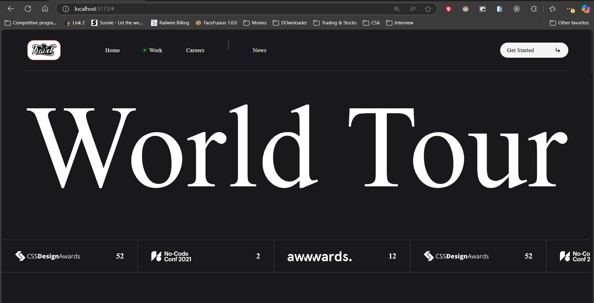
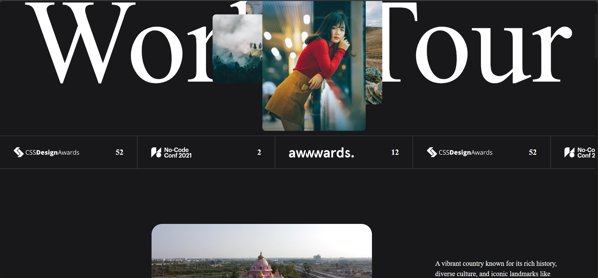
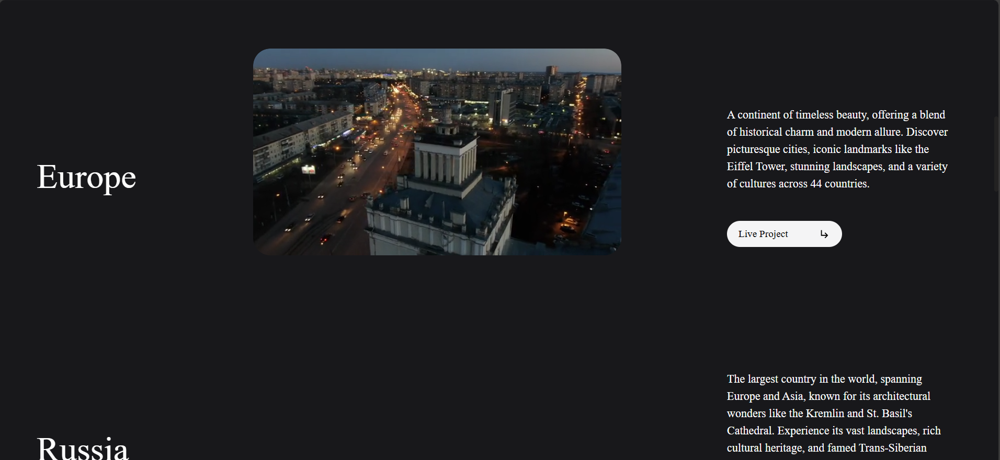

# About Travel Website 

Welcome to the Travel clone UI project!. it utilizes Locomotive Scroll and GSAP for smooth scrolling effects, and Shery.js for animations.

## Features

- **Replicated Design**
- **HTML, CSS, JavaScript**
- **Smooth Scrolling**:for smooth scrolling effects using Locomotive Scroll.
- **Animations**: Incorporate animations using GSAP and Shery.js.

## Tech Stack

- HTML
- CSS
- JavaScript
- React
- Locomotive Scroll: Enables smooth and seamless scrolling effects for an enhanced user experience.
- GSAP: A powerful tool for implementing professional-grade animations.
- Shery.js:  Simplifies the creation of scroll-based animations.

## "Live Site" = https://travel-book2.netlify.app/ 

## Preview Result

## Acknowledgements

- [Locomotive Scroll](https://locomotivemtl.github.io/locomotive-scroll/) - For providing smooth scrolling effects.
- [GSAP](https://greensock.com/gsap/) - For offering powerful animation tools and libraries.
- [Shery.js](https://sheryjs.dev/) - For enabling scroll animations.

