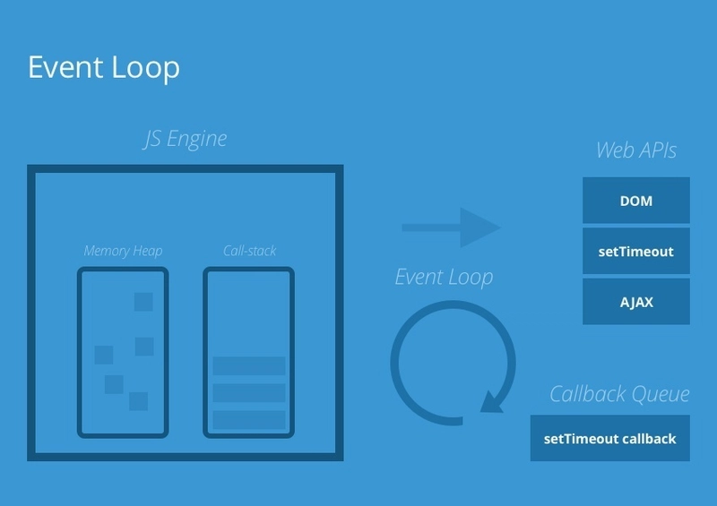

### 1. Automatic Type conversion in Js happens based on the hint of operator
-  '8' + 9 -> (Output -> 89) isme js sochta hai ki user agar addition operator use kiya hai toh wo string ko concatination ko perform krta hai .
-  '9' - 9 -> (Output -> 0) isme js sochta hai ki minus to sirf number me hi hota hai so string can be converted to number then it is done then perform subtraction.
-  let msg = `hi ${[1,2,3,[4,[5,4]],4]} my array` -> Array is converted into string 
    Output  - "hi 1,2,3,4,5,4,4,4"
- String({"name" : "vinay Singh"})
    Ouput  - [Object Object]     


### 2. Null operator ka Type object ku hai ? 
 - Aisa isliye hai kyuki JavaScript ke jo hai c aur c++ ka use karke banaya gaya hai, aur c mein null ko object ke roop mein treat kiya jata hai. isiliye JavaScript mein bhi null ka type "object" return karta hai. ye ek purana bug hai jo abhi tak JavaScript mein bana hua hai.

### 3. Explicit type conversion
JS ne kuch static features provide kiya hai to use for type conversion. Like Number() , Boolean() , String(). Yha par kuch alag feature bhi hai jaise num.toString() or parseInt(). toString() wale method ko jab num.String() ke sath kese use kr pa rahe hai? num to sirf ek number hai not object right ? Aise is liye kya hota hai js internally is number ko pehle ek number object me convert krti hai fir call krti hai uspr ye function. aur us object ko destroy kr deti . Ye issue tab create kr skta hai jab asi hi kai sari calls ke liye ye hamr baar baar krna pade jo ki ek problem hai isiliye hum dynamic method ka use pasand krte hai.

### 4. Output question
- 3.toString() - > error . 
     - Reason - dot operator ka use 2 places me hota hai first as decimal aur dusra object ki keys ko access krne ke liye. Toh jab hum number directly kisi property ka use krne ke liye dot ka use krte hai toh js confuse hoi jata hai krna kya hai. To solve this issue use this way (3).toString() it tells the number is completed now it's property.


### 5. Falsy values in js 
- 6 type of falsy values in js. ( 0 , "", null, false, undefined, NaN )

### 6. In js only two values are there where we can't do comparison ( NaN , -0) because it won't give the correct answer if we compared anything with this.
    ``` jsx
    NaN == NaN  -> false
    0 == 0  -> true
    0 == -0  -> false
    -0 == -0 -> true
    0 != 0 -> false
    so for comparison in this we use 
    Object.is(0,-0) -> false
    Object.is(NaN, NaN) -> True
    
    ```

### 7. Currying in JS
- Currying is a technique in functional programming where a function that takes multiple arguments is transformed into a series of functions that each take a single argument and return another function. This allows for partial application of functions. For example, a function f(a, b, c) can be curried into f(a)(b)(c). 
- It also uses multiple concept like closure and partial application.


- Rules
    1. Return a function until all required arguments are supplied.
    2. Number of nested functions = number of arguments of the original function.
    3. Must support partial application (useful to stop midway).

- Few Real life example 

```jsx

// 🔰 First example  - Our Real life example - first set up the base with gas and water (brewTea), then lock in tea leaves (addTeaLeaves), and finally finish later by adding the last input like ginger to serve (teaIsReady("🫚")). This shows a half-ready workflow where earlier steps are fixed and the final call supplies the remaining ingredient, which is exactly what currying enables 
function brewTea()
{
    // gas on kr di
    // pani daal diya

    return function addTeaLeaves()
    {
        console.log("Tea leaves added");

        return function teaIsReady(ginger){
            console.log("Ginger added", ginger);
            console.log("Tea is Ready");
        };
    };
}
 
const addTeaLeaves  = brewTea(); 
const teaIsReady = addTeaLeaves();
teaIsReady("🫚")

```

``` jsx
// 🔰 Second example


// Without currying
function sum(a,b,c)
{
    return a+b+c;
}

sum(4,5,1);   // return 10


function sum(a)
{
    return function(b){
        
        return function(c)
        {
            return a+b+c;
        }
    }
}

let firstValue = sum;  

let secondValue = firstValue(4); // returned function(b), it becomes firstValue = function(b) 
let thirdValue = secondValue(5); // secondValue = function(c)
let Result =  thirdValue(1) // thirdValue = a+b+c

console.log(result);  // 10

// With currying 
ler result  = sum;
console.log(result(3)(3)(3));


```

``` jsx

// 🔰 Third Example with Multiple arguments in single function


function curry(fn) {
  return function curried(...args) {
    if (args.length >= fn.length) {
      return fn(...args); // if enough args, call original
    } else {
      return (...myNextArgs) => curried(...args, ...myNextArgs);
    }
  };
}

function sum(a, b, c) {
  return a + b + c;
}

const curriedSum = curry(sum);

console.log(curriedSum(1)(2)(3)); // 6
console.log(curriedSum(1, 2)(3)); // 6

//Output Visual flow - curriedSum(1)(2)(3)
// ...args and ...myNextArgs is nothing taking arguments and working as rest and spread operator.

(1) → args:[1] ──> return fn waiting for myNextArgs
   (2) → myNextArgs:[2] + args:[1] = [1,2] ──> return fn waiting for myNextArgs
      (3) → myNextArgs:[3] + args:[1,2] = [1,2,3] ──> sum = 6


```

### 7. Question : How do you currying over the infinite arguments
- Problem - Make a curry function for sum(2)(3)(4)(5)(43)(4)(43)(2)(9)() . This can go upto n.
- Solution - We have to make sure that in currying we will be using recursive function to handle nth arguments

```jsx

function sum(a)
{
    return function (b)
    {
        if(b == undefined)
        {
            return a; // base condition 
        }
        else
        {
           sum(a+b); // recursive call
        }
    };
}


const result = sum(2)(3)(4)(5)(43)(4)(43)(2)(9)() ; // Must note the base condition is empty arguments

console.log(result);

``` 

### 8. Question : 🔎 Why currying is useful here
- With a normal function, you can simulate this by manually wrapping it yourself.
- But currying makes this pattern systematic and reusable:
  - You fix arguments progressively.
  - Each step creates a new, specialized function.


### 9. Question : What was the need of IIFE before ES6 and Why it was used to create in the concept of private scoping ?
- The Problem (when only var existed)
  - var has function scope, not block scope.
  - So variables declared with var in a loop or inside {} blocks don’t get their own copy — they all share the same one.

    ``` js

    for (var i = 0; i < 3; i++) {
    setTimeout(function() {
        console.log(i);
    }, 100);
    }
    // ❌ Prints: 3, 3, 3


    // Why?
    // var i is declared once, outside the loop’s block.
    // All the setTimeout callbacks close over the same i.

    ```

    - 🔹 The Hack (IIFE to create private scope)  
    - Use an Immediately Invoked Function Expression to “capture” the value of i at each iteration.

    ``` js

    for (var i = 0; i < 3; i++) {
    (function(copy) {
        setTimeout(function() {
        console.log(copy);
        }, 100);
    })(i); // pass current i immediately
    }
    // ✅ Prints: 0, 1, 2

    // Explanation
    // IIFE runs immediately -> (function(copy){ ... })(i) executes right away. -> Creates a new function scope each time -> Every loop iteration calls the IIFE. -> Inside, copy is a parameter, and parameters in JS are scoped to that function call.

    ```

## Question: Async VS Differ Attribute in Script.
Blog - [Async VS Differ](../Images/async.webp)
1. 
- Default behaviour
    - We generally connect our HTML page with external javascript with `script` tag. Traditionally, JavaScript `script` tags were often placed in the `head` section of the HTML document. However, doing so means that the parsing of the HTML is blocked until the JavaScript file is fetched and executed, leading to slower page load times.
        ### Syntax

        ``` js
        <script src="analytics.js" ></script>
        ```
- Async
    - When we include a script with the async attribute, it tells the browser to download the script asynchronously while parsing the HTML document. The script is downloaded in the background without blocking the HTML parsing process.
    - Once the script is downloaded, it's executed asynchronously, meaning it can run at any time, even before the HTML document has finished parsing.
        ### Syntax

        ``` js
        <script src="analytics.js" async></script>
        ```
- Defer
    - When we include a script with the defer attribute, it also tells the browser to download the script asynchronously while parsing the HTML document.
    - However, the execution of the script is deferred until after the HTML document has been parsed.
        ### Syntax
        ``` js
        <script src="app.js" defer></script>

        ```


## Question : How the actually browser woks with your request towards your entered URL?
- [Web browser rendering](https://dev.to/arikaturika/how-web-browsers-work-the-render-tree-part-7-with-illustrations-24h3)
- Summary is Below 
1. Navigation
    - You type a URL or click a link.
    - Browser does a DNS lookup to find the server’s IP address.
    - Then establishes a connection using TCP handshake (and TLS if HTTPS).

2. Fetching
    - Browser sends an HTTP request (like GET /index.html).
    - Server replies with response headers + body (usually the HTML).
    - Browser does not wait for the entire HTML file — it starts streaming and parsing as soon as data arrives.
    - “Time to First Byte (TTFB)” = time from request to first response byte received.

3. Parsing HTML
    - Browser reads HTML and builds the DOM tree.
    - Important cases when it encounters resources: 
      - External CSS (`link rel="stylesheet`)
        - CSS is render-blocking, not parse-blocking ( continue reading the page but don't render).
        - HTML parser keeps going, but render tree creation and painting must wait until CSS is downloaded + parsed into the CSSOM.
        - That’s why large CSS or CSS from slow servers can delay first render.

      - JavaScript (`script` without async or defer)
        - This is parse-blocking ( don't read and stop rendering).
        -  HTML parsing pauses immediately, the script is fetched (if not cached), executed right away, then parsing resumes.
        - Reason: JS can modify the DOM (document.write, DOM APIs), so the browser must stop until script finishes.
        - Reason: JS can modify the DOM (document.write, DOM APIs), so the browser must stop until script finishes.

      - JavaScript with async
        - Script download starts in parallel.
        - Script executes as soon as it finishes downloading, even if HTML parsing isn’t done.
        - Parsing continues in the meantime, but execution order is unpredictable.

      - JavaScript with defer
        - Script download starts in parallel.
        - Execution waits until after HTML parsing finishes, and scripts run in order they appear.
        - This avoids blocking parsing.

4. Parsing CSS
    - When CSS files are fetched, the browser:
    - Tokenizes CSS into selectors, properties, values.
    - Builds the CSSOM tree.
      - CSSOM + DOM are needed before rendering.
    - That’s why CSS is render-blocking: without styles, layout/paint can’t happen.

5. Executing JavaScript ( V8 Engine - how it executes)
    - JS engine parses code into AST (Abstract Syntax Tree).
    - vExecutes code via interpreter/JIT compilation.
    - JS can modify DOM or CSSOM, causing:
      - Reflow (layout recalculation)
      - Repaint (visual update)

6. Accessibility Tree
    - Built from DOM for assistive technologies (screen readers, etc.).
    - Includes semantic info: roles, labels, text content.

7. Render Tree, Layout, Painting ( At last render happens)
    - Combines DOM + CSSOM → Render Tree (only visible elements).


### Google V8 Engine when found JS how does it execute this JS code.
- Before 2008:
  - JavaScript engines in browsers mostly used interpreters.
  - They converted JavaScript into bytecode (or sometimes directly executed it line by line).
  - The big drawback: little to no optimization, so performance was slow and not adapted well to different hardware (16-bit, 32-bit, etc.).
  ``` js

      JavaScript Code  
      ↓  
      Parsing → AST  
      ↓  
      Interpreter → Bytecode → Execution

  ```

- After 2008 (Google’s V8 Engine):
  - Google introduced V8 with Chrome.'
  - Uses JIT as compiler to optimize later
  -Result: JavaScript execution became much faster and more efficient.
  - Steps:
    - Step 1:  JavaScript Code → Parsing → AST
      - The JS source code is parsed (syntax checked) and converted into an Abstract Syntax Tree (AST).
      - ✅ Needed because the engine can’t run raw text; AST gives structured representation of the code.
    - Step 2: AST → Ignition (Interpreter) → Bytecode
      - Ignition (V8’s interpreter) takes the AST and produces bytecode (a lower-level instruction set) and Starts execution .
      - Execution → runs line by line using Call Stack.Concept of Memory creation and Execution starts. Creates Execution Contexts for each function and all.
      - ✅ Needed to quickly start execution without waiting for full compilation.
    - Step 3: Profiler → Detect Hot Code
      - While running, V8 uses a Profiler to watch which parts of the code run frequently (loops, functions).
      - ✅ Needed because not all code deserves heavy optimization; only “hot” code is worth compiling
    - Step 4: TurboFan (JIT Compiler) → Optimized Machine Code
      - The profiler signals TurboFan to recompile hot bytecode into highly optimized machine code.
      - ✅ Needed for speed – machine code executes directly on the CPU and optimizations remove overhead.
    - Step 5: Execution
      - Optimized machine code runs on the CPU.

  ``` js

      JavaScript Code  
      ↓  
      Parsing → AST  
      ↓  
      Ignition (Interpreter) → Bytecode  
      ↓  
      Profiler → Detect hot code  
      ↓  
      TurboFan (Compiler) → Optimized Machine Code  
      ↓  
      Execution
      
  ```

## Question: Using Require( common js module import method) or Es6 New Method Can Affect the Execution of the JS files between multiple files? - Yes.
1. Static Import (ESM) : Synchronous 
    - Placement → Must be top-level (not inside if, function, loop). The engine will parse all import statements before executing any code, regardless of line number.
    - When loaded? → At parse time (before any code in the module runs).
    - Execution timing → Imported module executes before the importing file starts running. 
    ``` js
    // index.js
    console.log("running index.js");
    import { sum } from "./sum.js"; // it always move up in top no matter where written. It's not hoisting.
    console.log(sum(1, 2));
    
    // sum.js
    console.log("running sum.js");
    export const sum = (a, b) => a + b;

    // Output 
    running sum.js   // imported file runs first
    running index.js
    index start
    3

    ```

2. Dynamic Import (ESM) : Asynchronous (non-blocking).
    - Placement → Can be anywhere (inside function, condition, etc).
    - When loaded? → At runtime, only when that line runs.
    - Execution timing → Returns a Promise. File is fetched and executed lazily. 
    ``` js
      // index.js
      console.log('index start');

      if(true)
      {
      import('./sum.js').then(({ sum }) => {
        console.log(sum(1, 2));
      });
      console.log('index end');
      }


      // sum.js
      console.log('running sum.js');
      export const sum = (a, b) => a + b;
      
      // Output : 
      index start
      index end
      running sum.js    // only when import() executes
      3

    
    ```

3. Require (CommonJS, Node.js) : Synchronous In nature
    - Placement → Can be anywhere (since it’s just a function call). 
    - When loaded? → At runtime, - exactly where require is called. 
    - Execution timing → Synchronous (blocks until the file is read and executed). 

    ``` js

    // index.js
    console.log('index start');
    const { sum } = require('./sum.js');
    console.log(sum(1, 2));
    console.log('index end');
    
   // sum.js
    console.log('running sum.js');
    function sum(a, b) {
      return a + b;
    }
    module.exports = { sum }


    // Output :
    index start
    running sum.js   // executes right when require is called
    3
    index end

    
    ```


### Question:  📦 What is Boxing?
-   Boxing means wrapping a primitive value (like string, number, boolean) inside its corresponding object wrapper class (String, Number, Boolean) temporarily, so that you can use object-like methods on it.
- After the method/property is accessed, the wrapper is thrown away (it doesn’t stay in memory).
- wrapper classes are just built-in constructor functions, each with their own .prototype that stores methods for primitives. Boxing/unboxing is JavaScript’s way of letting primitive values temporarily “borrow” those methods.


### Question:  🎯 is everything in js is Object?
- Not everything is an object in JavaScript.
- The core values are split into: Primitives (not objects), Objects (everything else, including functions)

BUT 🤔 when you try to use methods on them, like:

"hi".toUpperCase(); ✅ // it works because of boxing

### 🔹 typeof for Constructors vs Instances
1. String 
  ```jsx 

  typeof "hi";        // "string"
  typeof String;      // "function"
  typeof String();    // "string"
  typeof new String() // "object"

  ```
2. Number
  ``` js

  typeof 42;          // "number"
  typeof Number;      // "function"
  typeof Number(42);  // "number"
  typeof new Number() // "object"

  ```
3. Array 
  ```jsx 

  typeof [1,2,3];       // "object"
  typeof Array;         // "function"
  typeof Array(3);      // "object"
  typeof new Array();   // "object"


  ```
4. Object
  ``` js

  typeof {a:1};         // "object"
  typeof Object;        // "function"
  typeof Object("x");   // "object"
  typeof new Object();  // "object"


  ```

5. Boolean 
  ``` js

  typeof true;            // "boolean"
  typeof Boolean;         // "function"
  typeof Boolean(1);      // "boolean"
  typeof new Boolean(1);  // "object"

  
  ```
6. Function 
  ``` js

  typeof function(){};  // "function"
  typeof Function;      // "function"
  typeof Function();    // "function"
  typeof new Function() // "function"


  
  ```

7. Null & undefined
  ```js

  typeof null;          // "object"  // historical bug
  typeof undefined;     // "undefined"

  (no constructor)
  ```

### (Lec - 13) 🤯 More Deep about Objects and Their Keys 
1. Property Descriptors
  - Every property in a JS object is more than just a key: value. It also has metadata stored in its Property Descriptor.
  - The 4 main attributes:
      - value: The actual stored value.
      - writable: Can we reassign the value? (default: true for literals).
      - enumerable: Will it show up in loops like for...in or Object.keys()? (default: true for literals).
      - configurable: Can we delete it or reconfigure its attributes? (default: true for literals).

      ```js

      const obj = { a: 10 }; // when you add property like this or any other type except one special type , there is no optimization possible.

      console.log(Object.getOwnPropertyDescriptor(obj, "a"));
      /*
      {
        value: 10,
        writable: true,
        enumerable: true,
        configurable: true
      }
      */

      ```
      If you use Object.defineProperty, you can customize:
      ```js

      const obj = {};
      Object.defineProperty(obj, "a", {
        value: 10,
        writable: false,
        enumerable: false,
        configurable: false
      });

      console.log(obj.a); // 10
      obj.a = 20;         // ❌ won't change because writable = false

      ```

### Disadvantages of using plain Objects
1. Key Types
  - Keys must be string or symbol. Other then symbol anything you use will be converted in string for key.
  - Using objects as keys gets converted to "[object Object]", which causes collisions.
    ```js 

      const obj = {};
      const key1 = { id: 1 };
      const key2 = { id: 2 };

      obj[key1] = "a";
      obj[key2] = "b";  
      console.log(obj); // { "[object Object]": "b" } ❌ collision , will override the Object key
    ```
2. Iteration order
3. Object keys are mostly unordered.
4. Performance degradation with frequent key changes ( Shaping problem)
5. Because of hidden class reshaping, adding/removing keys dynamically can reduce performance.


###  Hidden Classes / Shapes (Engine Optimization)
- When you create objects, JS engines (like V8) optimize them by internally creating a Shape (or Hidden Class) — kind of like a schema in databases.
    - When you first create an object, it gets a shape describing its keys.
    - Adding/removing keys changes the shape.
    - Instead of duplicating everything, engines maintain shapes in a linked structure, so a new shape can reference the old one with minimal copying.
- This is why adding properties dynamically in random order can hurt performance — the engine has to update shapes each time.
  ```js

  const obj = {};
  obj.x = 10;   // new shape created
  obj.y = 20;   // another shape


  ```

### Shallow Copy vs Deep Copy
1. `Shallow Copy` - 
    - Copies only one level of properties.
    - If the object contains nested objects/arrays, only the reference to those nested objects is copied.
    - So changes in nested objects affect both copies.
    - ⚠️ Limitation: Nested objects/arrays are still referenced.

    ```js

    const originalArray = [1, 2, 3];
    const shallowCopy = originalArray;

    shallowCopy[0] = 10;

    console.log(originalArray); // Output: [10, 2, 3]
    
    const originalArray = [1, 2, 3];
    const shallowCopy = [...originalArray];

    ```

2. `Deep Copy` 
    - Deep copying, on the other hand, creates a completely independent copy of the original data structure, including all nested objects or arrays. It recursively traverses the entire data structure and creates new instances of all properties or elements.
    - Nested objects/arrays are duplicated, not referenced.
    - Changes in nested objects do not affect the original.

    ```js

    const originalArray = [1, 2, 3];
    const deepCopy = JSON.parse(JSON.stringify(originalArray)); //
    // Disadvantage of above method - ❌ Doesn’t handle functions, undefined, Date, Map, Set.

    deepCopy[0] = 10;

    console.log(originalArray); // Output: [1, 2, 3]
    console.log(deepCopy); // Output: [10, 2, 3]
    
    ```
3. ✅ Interview takeaway (short answer)
    - Shallow copy → only first level copied, nested objects share reference.
    - Deep copy → full independent copy, nested objects cloned.


### (Lec -  21) Promises 
1. 

### (Lec  - 23) Fetch API
1. [Fetch API Blog](https://dev.to/omriluz1/fetch-api-advanced-features-and-error-handling-3271)


### ( Lec - 26) Lexical Scope & Closure
1. [Lexical Scope and Closure Blog](https://dev.to/antonzo/lexical-scope-lexical-environment-execution-context-closure-in-javascript-5bn61)


### (Lec- 27) Images of Call Stack and how JS code executes by JS engine.
1. 
2. 

